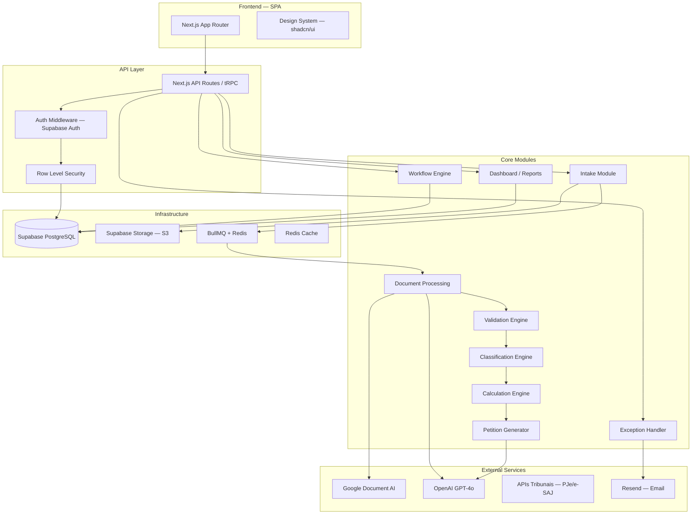
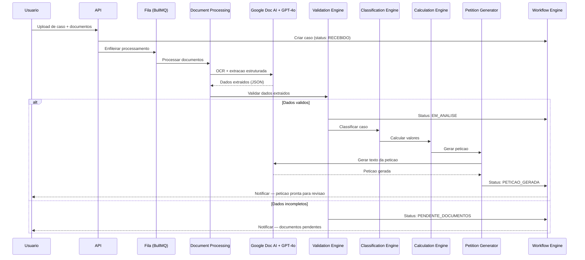
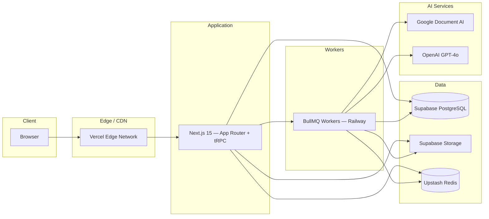
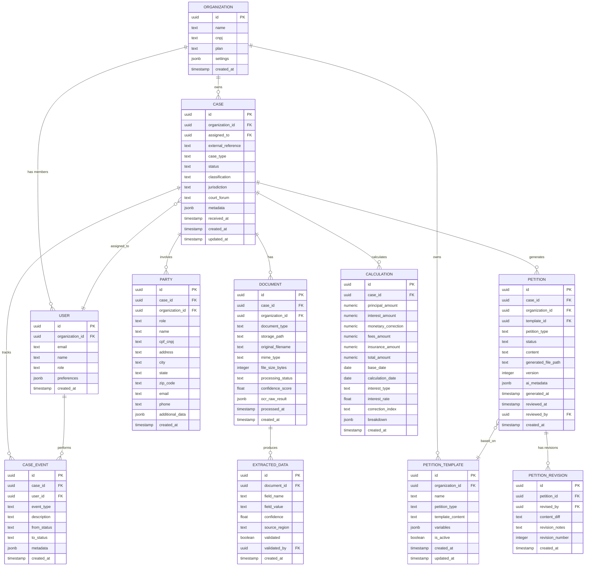
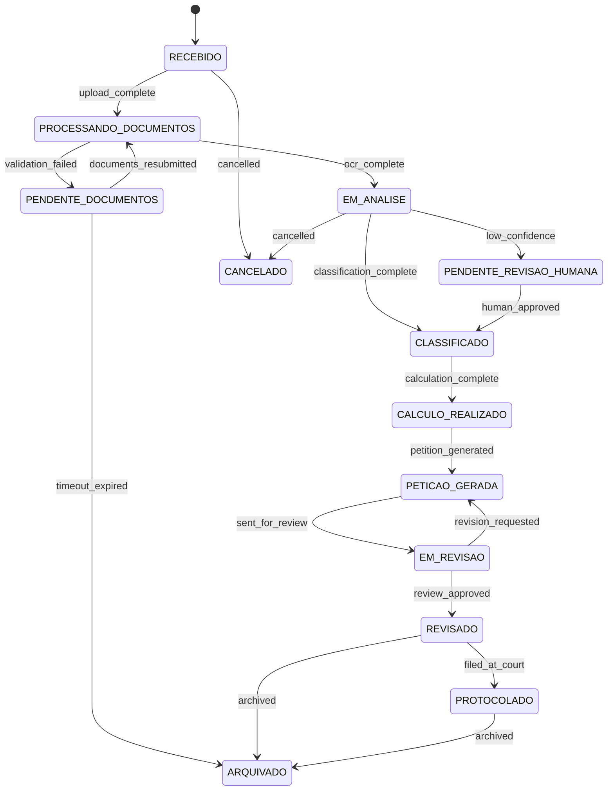
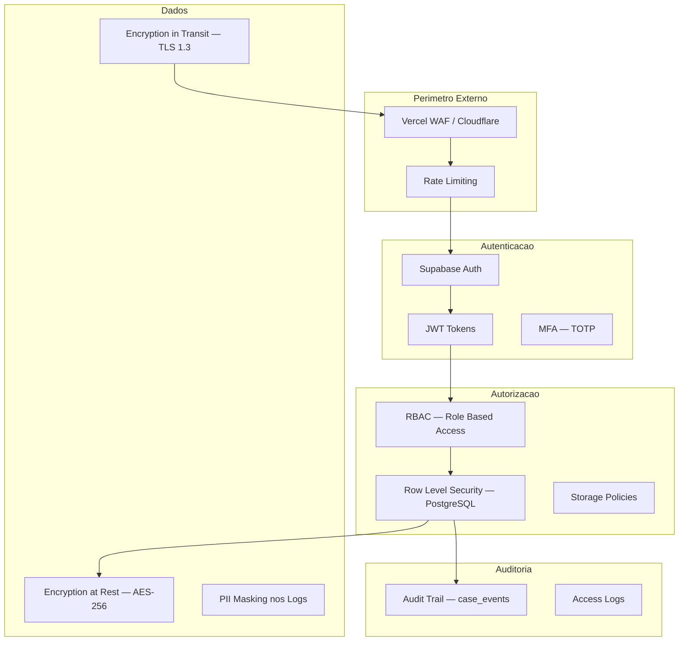
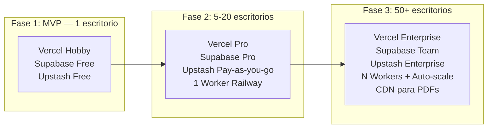

# Arquitetura Tecnica — MicroSaaS Juridico de Execucoes e Cobrancas Bancarias

**Agente:** @architect (Aria)
**Classificacao de Complexidade:** COMPLEX (score estimado: 19/25)
**Data:** 2026-03-21

---

## 1. Arquitetura de Alto Nivel

### 1.1 Padrao Arquitetural: Monolito Modular com Extracao Progressiva

**Escolha:** Monolito Modular (Modular Monolith) com fila assincrona para processamento pesado.

**Justificativa:**

| Criterio | Monolito Modular | Microsservicos | Serverless |
|----------|-----------------|---------------|------------|
| Time-to-market | Rapido | Lento | Medio |
| Complexidade operacional | Baixa | Alta | Media |
| Custo inicial | Baixo | Alto | Medio |
| Escalabilidade futura | Boa (extracao progressiva) | Excelente | Boa |
| Debugging/tracing | Simples | Complexo | Medio |
| Equipe necessaria | 1-3 devs | 5+ devs | 2-4 devs |

Para um microSaaS juridico, a prioridade e validar o produto rapidamente com custo controlado. O monolito modular permite comecar simples e extrair modulos para servicos independentes conforme a demanda cresce (ex: o Document Processing pode virar um servico separado quando o volume justificar).

### 1.2 Diagrama de Componentes



### 1.3 Fluxo Principal de Dados



---

## 2. Stack Tecnologico

### 2.1 Decisoes de Stack

| Camada | Tecnologia | Justificativa |
|--------|-----------|---------------|
| **Frontend** | Next.js 15 (App Router) | SSR, RSC, API routes integradas, ecossistema maduro |
| **UI Library** | shadcn/ui + Tailwind CSS 4 | Componentes acessiveis, customizaveis, sem vendor lock-in |
| **State Management** | TanStack Query + Zustand | Query para server state, Zustand para UI state minimo |
| **Backend** | Next.js API Routes + tRPC | Type-safety end-to-end, sem necessidade de servidor separado |
| **ORM** | Drizzle ORM | Type-safe, performatico, migrations declarativas, boa integracao com PostgreSQL |
| **Database** | PostgreSQL via Supabase | RLS nativo, auth integrado, storage, real-time, free tier generoso |
| **File Storage** | Supabase Storage (S3-compatible) | Integrado com RLS, politicas de acesso por tenant |
| **IA — OCR** | Google Document AI | Melhor OCR do mercado para documentos brasileiros, suporte a handwriting |
| **IA — NLP/Geracao** | OpenAI GPT-4o | Extracao estruturada, classificacao, geracao de peticoes |
| **Fila** | BullMQ + Redis (Upstash) | Filas robustas, retry, dead letter queue, dashboard |
| **Cache** | Redis (Upstash) | Serverless Redis, mesmo provider da fila |
| **Email** | Resend | API moderna, boa entregabilidade, SDK TypeScript |
| **Hosting** | Vercel (frontend) + Railway/Fly.io (workers) | Vercel para Next.js, workers separados para processamento pesado |
| **CI/CD** | GitHub Actions | Integrado com o repositorio, gratuito para open source |
| **Monitoramento** | Sentry + Axiom | Error tracking + logs estruturados |

### 2.2 Diagrama de Stack



---

## 3. Modelo de Dados

### 3.1 Entidades Principais e Relacionamentos



### 3.2 Enumeracoes Criticas

```sql
-- Tipos de caso
CREATE TYPE case_type AS ENUM (
    'EXECUCAO_TITULO_EXTRAJUDICIAL',
    'ACAO_COBRANCA',
    'MONITORIA',
    'EXECUCAO_HIPOTECARIA',
    'BUSCA_APREENSAO'
);

-- Status do pipeline
CREATE TYPE case_status AS ENUM (
    'RECEBIDO',
    'PROCESSANDO_DOCUMENTOS',
    'EM_ANALISE',
    'PENDENTE_DOCUMENTOS',
    'PENDENTE_REVISAO_HUMANA',
    'CLASSIFICADO',
    'CALCULO_REALIZADO',
    'PETICAO_GERADA',
    'EM_REVISAO',
    'REVISADO',
    'PROTOCOLADO',
    'ARQUIVADO',
    'CANCELADO'
);

-- Tipo de documento
CREATE TYPE document_type AS ENUM (
    'CEDULA_CREDITO_BANCARIO',
    'CONTRATO_EMPRESTIMO',
    'CONTRATO_FINANCIAMENTO',
    'NOTA_PROMISSORIA',
    'CHEQUE',
    'DUPLICATA',
    'CONFISSAO_DIVIDA',
    'EXTRATO_DEBITO',
    'NOTIFICACAO_EXTRAJUDICIAL',
    'PROCURACAO',
    'CONTRATO_SOCIAL',
    'DOCUMENTO_IDENTIFICACAO',
    'COMPROVANTE_ENDERECO',
    'OUTROS'
);

-- Papel da parte
CREATE TYPE party_role AS ENUM (
    'CREDOR',
    'DEVEDOR',
    'AVALISTA',
    'FIADOR',
    'CODEVEDORA',
    'REPRESENTANTE_LEGAL'
);

-- Status de processamento de documento
CREATE TYPE document_processing_status AS ENUM (
    'PENDING',
    'PROCESSING',
    'COMPLETED',
    'FAILED',
    'REQUIRES_MANUAL_REVIEW'
);
```

### 3.3 Row Level Security (Multi-tenancy)

```sql
-- Politica base: todo acesso filtrado por organization_id
ALTER TABLE cases ENABLE ROW LEVEL SECURITY;

CREATE POLICY "cases_org_isolation" ON cases
    USING (organization_id = auth.jwt() ->> 'organization_id');

CREATE POLICY "cases_insert" ON cases
    FOR INSERT
    WITH CHECK (organization_id = auth.jwt() ->> 'organization_id');

-- Replicar para TODAS as tabelas com organization_id
-- documents, parties, petitions, petition_templates, case_events, calculations
```

---

## 4. Modulos do Sistema

### 4.1 Intake Module

| Aspecto | Detalhe |
|---------|---------|
| **Responsabilidade** | Receber casos e documentos, criar registro inicial, enfileirar processamento |
| **Inputs** | Upload manual (drag-and-drop), CSV batch import, API de integracao com cooperativas |
| **Outputs** | Case record (status: RECEBIDO), Documents armazenados no Storage, Job na fila |
| **Integracoes** | Supabase Storage, BullMQ |

**Fluxos de entrada suportados:**

```typescript
// 1. Upload manual via UI
interface ManualIntakeInput {
  organizationId: string;
  externalReference?: string;
  documents: File[];           // PDFs, imagens
  partyData?: Partial<Party>[]; // dados opcionais preenchidos pelo usuario
  notes?: string;
}

// 2. Batch import via CSV
interface BatchIntakeInput {
  organizationId: string;
  csvFile: File;               // CSV com dados estruturados
  documentsZip?: File;         // ZIP com documentos referenciados
}

// 3. API de integracao (cooperativas)
interface ApiIntakeInput {
  organizationId: string;
  externalReference: string;
  caseType: CaseType;
  parties: Party[];
  documents: DocumentPayload[]; // base64 ou URL
  debtData: DebtData;
}
```

### 4.2 Document Processing Module

| Aspecto | Detalhe |
|---------|---------|
| **Responsabilidade** | OCR de documentos, extracao estruturada de dados via IA, normalizacao |
| **Inputs** | Documento (PDF/imagem) do Storage |
| **Outputs** | Dados extraidos estruturados (ExtractedData[]), confidence scores |
| **Integracoes** | Google Document AI (OCR), OpenAI GPT-4o (extracao estruturada) |

**Pipeline de processamento:**

```typescript
async function processDocument(documentId: string): Promise<ExtractionResult> {
  // 1. Download do Storage
  const file = await storage.download(document.storagePath);

  // 2. OCR via Google Document AI
  const ocrResult = await documentAI.processDocument({
    content: file,
    mimeType: document.mimeType,
    processorId: getProcessorForType(document.documentType),
  });

  // 3. Extracao estruturada via GPT-4o
  const extractedData = await openai.chat.completions.create({
    model: 'gpt-4o',
    messages: [
      {
        role: 'system',
        content: EXTRACTION_PROMPT_BY_DOC_TYPE[document.documentType],
      },
      {
        role: 'user',
        content: [
          { type: 'text', text: ocrResult.text },
          // Incluir imagem original para validacao cruzada
          { type: 'image_url', url: file.toBase64Url() },
        ],
      },
    ],
    response_format: { type: 'json_schema', schema: EXTRACTION_SCHEMA },
  });

  // 4. Normalizar e persistir
  const normalized = normalizeExtractedData(extractedData);
  await db.extractedData.insertMany(normalized);

  return { documentId, data: normalized, confidence: ocrResult.confidence };
}
```

**Prompts de extracao (por tipo de documento):**

Para uma Cedula de Credito Bancario, o prompt extrai: valor principal, taxa de juros, indice de correcao, data de vencimento, dados do devedor (nome, CPF/CNPJ, endereco), dados do avalista, dados do credor, numero da cedula, data de emissao, clausulas de vencimento antecipado.

### 4.3 Validation Engine

| Aspecto | Detalhe |
|---------|---------|
| **Responsabilidade** | Validar completude e consistencia dos dados extraidos |
| **Inputs** | ExtractedData[] do caso |
| **Outputs** | ValidationResult (VALID, INVALID, NEEDS_REVIEW), lista de issues |
| **Integracoes** | Exception Handler (para casos invalidos) |

**Regras de validacao:**

```typescript
interface ValidationRule {
  id: string;
  description: string;
  severity: 'BLOCKING' | 'WARNING' | 'INFO';
  validate: (caseData: CaseData) => ValidationIssue | null;
}

const VALIDATION_RULES: ValidationRule[] = [
  // Regras de completude
  {
    id: 'DEVEDOR_CPF_REQUIRED',
    description: 'Devedor deve ter CPF ou CNPJ',
    severity: 'BLOCKING',
    validate: (data) =>
      data.parties.filter(p => p.role === 'DEVEDOR')
        .some(p => !p.cpfCnpj)
        ? { field: 'party.cpfCnpj', message: 'CPF/CNPJ do devedor ausente' }
        : null,
  },
  {
    id: 'VALOR_PRINCIPAL_REQUIRED',
    description: 'Valor principal da divida deve estar presente',
    severity: 'BLOCKING',
    validate: (data) =>
      !data.calculation?.principalAmount
        ? { field: 'calculation.principalAmount', message: 'Valor principal nao identificado' }
        : null,
  },
  {
    id: 'DOCUMENTO_ASSINADO',
    description: 'Documento principal deve ter assinatura detectada',
    severity: 'BLOCKING',
    validate: (data) =>
      data.documents.some(d =>
        d.type === 'CEDULA_CREDITO_BANCARIO' && !d.hasSignature
      )
        ? { field: 'document.signature', message: 'Assinatura nao detectada na cedula' }
        : null,
  },
  {
    id: 'VENCIMENTO_ANTERIOR',
    description: 'Data de vencimento deve ser anterior a data atual',
    severity: 'WARNING',
    validate: (data) =>
      data.dueDate && new Date(data.dueDate) > new Date()
        ? { field: 'dueDate', message: 'Divida ainda nao vencida' }
        : null,
  },
  // ... 20+ regras adicionais
];
```

### 4.4 Classification Engine

| Aspecto | Detalhe |
|---------|---------|
| **Responsabilidade** | Classificar o caso no tipo processual correto e determinar o foro competente |
| **Inputs** | CaseData validado, ExtractedData[] |
| **Outputs** | classification (CaseType), jurisdiction, courtForum |
| **Integracoes** | API de comarcas/varas (se disponivel) |

**Logica de classificacao:**

```typescript
interface ClassificationResult {
  caseType: CaseType;
  jurisdiction: string;       // ex: "JUSTICA_ESTADUAL"
  courtForum: string;         // ex: "Foro Central da Comarca de Sao Paulo"
  confidence: number;
  reasoning: string;
}

function classifyCase(data: CaseData): ClassificationResult {
  // Regra 1: Titulo extrajudicial -> Execucao de Titulo Extrajudicial
  if (isExtraJudicialTitle(data.primaryDocument.type)) {
    return {
      caseType: 'EXECUCAO_TITULO_EXTRAJUDICIAL',
      jurisdiction: 'JUSTICA_ESTADUAL',
      courtForum: determineForumByContract(data),
      confidence: 0.95,
      reasoning: 'Documento e titulo extrajudicial com liquidez, certeza e exigibilidade',
    };
  }

  // Regra 2: Sem titulo executivo -> Acao de Cobranca
  if (!hasExecutableTitle(data)) {
    return {
      caseType: 'ACAO_COBRANCA',
      jurisdiction: 'JUSTICA_ESTADUAL',
      courtForum: determineForumByDomicile(data),
      confidence: 0.85,
      reasoning: 'Ausencia de titulo executivo extrajudicial — via ordinaria',
    };
  }

  // Regra 3: Alienacao fiduciaria -> Busca e Apreensao
  if (hasAlienacaoFiduciaria(data)) {
    return {
      caseType: 'BUSCA_APREENSAO',
      jurisdiction: 'JUSTICA_ESTADUAL',
      courtForum: determineForumByContract(data),
      confidence: 0.90,
      reasoning: 'Contrato com alienacao fiduciaria — DL 911/69',
    };
  }

  // ... regras adicionais
}

// Determinacao de foro
function determineForumByContract(data: CaseData): string {
  // 1. Verificar clausula de eleicao de foro no contrato
  const foroEleito = data.extractedData.find(
    d => d.fieldName === 'clausula_foro'
  );
  if (foroEleito) return foroEleito.fieldValue;

  // 2. Fallback: domicilio do reu (Art. 46 CPC)
  const devedor = data.parties.find(p => p.role === 'DEVEDOR');
  if (devedor?.city && devedor?.state) {
    return `Comarca de ${devedor.city} - ${devedor.state}`;
  }

  return 'FORO_NAO_DETERMINADO';
}
```

### 4.5 Calculation Engine

| Aspecto | Detalhe |
|---------|---------|
| **Responsabilidade** | Calcular o valor atualizado da divida com juros, correcao monetaria, multas e encargos |
| **Inputs** | Dados financeiros extraidos, tabelas de indices |
| **Outputs** | Calculation record com breakdown detalhado |
| **Integracoes** | APIs de indices economicos (BCB, IBGE) |

```typescript
interface CalculationInput {
  principalAmount: number;       // Valor principal
  contractDate: Date;            // Data do contrato
  dueDate: Date;                 // Data de vencimento
  calculationDate: Date;         // Data do calculo (hoje)
  interestType: 'SIMPLES' | 'COMPOSTO' | 'TABELA_PRICE';
  interestRate: number;          // Taxa mensal (ex: 0.01 = 1%)
  correctionIndex: 'IGPM' | 'IPCA' | 'INPC' | 'CDI' | 'SELIC' | 'TR';
  lateFee: number;               // Multa moratoria (ex: 0.02 = 2%)
  insuranceAmount?: number;      // Seguro prestamista
  administrativeFees?: number;   // Tarifas administrativas
  contractualPenalty?: number;   // Clausula penal
}

interface CalculationResult {
  principalAmount: number;
  monetaryCorrection: number;
  interestAmount: number;
  lateFeeAmount: number;
  insuranceAmount: number;
  administrativeFees: number;
  contractualPenalty: number;
  totalAmount: number;
  baseDate: Date;
  calculationDate: Date;
  breakdown: CalculationBreakdownEntry[]; // mes a mes
}

// Busca indices economicos via API do BCB
async function fetchCorrectionIndex(
  index: CorrectionIndex,
  startDate: Date,
  endDate: Date
): Promise<IndexEntry[]> {
  const BCB_SERIES: Record<CorrectionIndex, number> = {
    IGPM: 189,
    IPCA: 433,
    INPC: 188,
    CDI: 12,
    SELIC: 11,
    TR: 226,
  };

  const response = await fetch(
    `https://api.bcb.gov.br/dados/serie/bcdata.sgs.${BCB_SERIES[index]}/dados` +
    `?formato=json&dataInicial=${formatDate(startDate)}&dataFinal=${formatDate(endDate)}`
  );

  return response.json();
}
```

### 4.6 Petition Generator

| Aspecto | Detalhe |
|---------|---------|
| **Responsabilidade** | Gerar peticao inicial completa a partir de template + dados do caso |
| **Inputs** | CaseData, Classification, Calculation, PetitionTemplate |
| **Outputs** | Petition (conteudo textual + PDF gerado) |
| **Integracoes** | OpenAI GPT-4o (geracao/refinamento), puppeteer/react-pdf (geracao PDF) |

**Arquitetura de geracao em camadas:**

```typescript
async function generatePetition(caseId: string): Promise<Petition> {
  const caseData = await loadFullCaseData(caseId);
  const template = await selectTemplate(caseData.classification);
  const calculation = await loadCalculation(caseId);

  // Camada 1: Template com variaveis preenchidas (deterministico)
  const baseContent = renderTemplate(template, {
    credor: caseData.parties.find(p => p.role === 'CREDOR'),
    devedor: caseData.parties.find(p => p.role === 'DEVEDOR'),
    avalistas: caseData.parties.filter(p => p.role === 'AVALISTA'),
    valorCausa: calculation.totalAmount,
    foro: caseData.courtForum,
    contratoNumero: caseData.externalReference,
    dataVencimento: caseData.dueDate,
    // ... todas as variaveis do template
  });

  // Camada 2: Refinamento por IA (fundamentacao juridica, coesao textual)
  const refinedContent = await openai.chat.completions.create({
    model: 'gpt-4o',
    messages: [
      {
        role: 'system',
        content: PETITION_REFINEMENT_PROMPT,
        // Prompt instrui a IA a:
        // - Manter todos os dados faticos exatamente como recebidos
        // - Adicionar fundamentacao juridica pertinente
        // - Melhorar coesao e coerencia textual
        // - Formatar conforme padroes forenses
        // - NAO inventar fatos ou dados
      },
      {
        role: 'user',
        content: baseContent,
      },
    ],
  });

  // Camada 3: Geracao do PDF
  const pdfPath = await generatePDF(refinedContent.content);

  // Persistir
  return await db.petitions.insert({
    caseId,
    templateId: template.id,
    organizationId: caseData.organizationId,
    petitionType: caseData.classification,
    content: refinedContent.content,
    generatedFilePath: pdfPath,
    status: 'GERADA',
    version: 1,
    aiMetadata: {
      model: 'gpt-4o',
      templateVersion: template.version,
      tokensUsed: refinedContent.usage,
    },
  });
}
```

### 4.7 Workflow Engine

| Aspecto | Detalhe |
|---------|---------|
| **Responsabilidade** | Gerenciar o pipeline de status do caso, garantir transicoes validas, registrar eventos |
| **Inputs** | Acao de transicao de status |
| **Outputs** | Status atualizado, CaseEvent registrado, notificacoes disparadas |
| **Integracoes** | Email (Resend), WebSocket (Supabase Realtime) |

**Maquina de estados:**



```typescript
// Transicoes validas (state machine)
const VALID_TRANSITIONS: Record<CaseStatus, CaseStatus[]> = {
  RECEBIDO: ['PROCESSANDO_DOCUMENTOS', 'CANCELADO'],
  PROCESSANDO_DOCUMENTOS: ['EM_ANALISE', 'PENDENTE_DOCUMENTOS'],
  PENDENTE_DOCUMENTOS: ['PROCESSANDO_DOCUMENTOS', 'ARQUIVADO'],
  EM_ANALISE: ['CLASSIFICADO', 'PENDENTE_REVISAO_HUMANA', 'CANCELADO'],
  PENDENTE_REVISAO_HUMANA: ['CLASSIFICADO'],
  CLASSIFICADO: ['CALCULO_REALIZADO'],
  CALCULO_REALIZADO: ['PETICAO_GERADA'],
  PETICAO_GERADA: ['EM_REVISAO'],
  EM_REVISAO: ['PETICAO_GERADA', 'REVISADO'],
  REVISADO: ['PROTOCOLADO', 'ARQUIVADO'],
  PROTOCOLADO: ['ARQUIVADO'],
  CANCELADO: [],
  ARQUIVADO: [],
};

async function transitionCase(
  caseId: string,
  toStatus: CaseStatus,
  userId: string,
  metadata?: Record<string, unknown>
): Promise<void> {
  const case_ = await db.cases.findById(caseId);

  if (!VALID_TRANSITIONS[case_.status].includes(toStatus)) {
    throw new InvalidTransitionError(case_.status, toStatus);
  }

  await db.transaction(async (tx) => {
    // Atualizar status
    await tx.cases.update(caseId, { status: toStatus, updatedAt: new Date() });

    // Registrar evento
    await tx.caseEvents.insert({
      caseId,
      userId,
      eventType: 'STATUS_CHANGE',
      fromStatus: case_.status,
      toStatus,
      metadata,
    });
  });

  // Notificacoes assincronas
  await notifyStatusChange(caseId, case_.status, toStatus);
}
```

### 4.8 Exception Handler

| Aspecto | Detalhe |
|---------|---------|
| **Responsabilidade** | Detectar e tratar excecoes no pipeline, encaminhar para revisao humana quando necessario |
| **Inputs** | Eventos de erro/excecao de qualquer modulo |
| **Outputs** | Notificacao ao usuario, encaminhamento para fila de revisao |
| **Integracoes** | Email (Resend), Dashboard, Workflow Engine |

**Categorias de excecao:**

```typescript
enum ExceptionCategory {
  // Documentos
  DOCUMENT_UNREADABLE = 'DOCUMENT_UNREADABLE',        // OCR falhou
  DOCUMENT_INCOMPLETE = 'DOCUMENT_INCOMPLETE',          // Dados faltando
  SIGNATURE_NOT_FOUND = 'SIGNATURE_NOT_FOUND',          // Sem assinatura
  DOCUMENT_EXPIRED = 'DOCUMENT_EXPIRED',                // Documento vencido

  // Dados
  CPF_CNPJ_INVALID = 'CPF_CNPJ_INVALID',              // CPF/CNPJ invalido
  ADDRESS_INCOMPLETE = 'ADDRESS_INCOMPLETE',            // Endereco incompleto
  AMOUNT_MISMATCH = 'AMOUNT_MISMATCH',                 // Valores divergentes

  // Processamento
  LOW_CONFIDENCE = 'LOW_CONFIDENCE',                    // Confianca < threshold
  CLASSIFICATION_AMBIGUOUS = 'CLASSIFICATION_AMBIGUOUS', // Classificacao incerta
  CALCULATION_ERROR = 'CALCULATION_ERROR',              // Erro no calculo

  // Externo
  COURT_API_UNAVAILABLE = 'COURT_API_UNAVAILABLE',     // API do tribunal fora
  INDEX_DATA_UNAVAILABLE = 'INDEX_DATA_UNAVAILABLE',   // Indice economico indisponivel
}

interface ExceptionHandler {
  category: ExceptionCategory;
  severity: 'AUTO_RESOLVE' | 'NEEDS_REVIEW' | 'BLOCKING';
  handler: (context: ExceptionContext) => Promise<ExceptionResolution>;
}
```

### 4.9 Dashboard / Reports

| Aspecto | Detalhe |
|---------|---------|
| **Responsabilidade** | Visibilidade operacional, metricas, relatorios |
| **Inputs** | Dados agregados de todas as entidades |
| **Outputs** | Dashboards interativos, relatorios exportaveis |
| **Integracoes** | Supabase Realtime (atualizacoes em tempo real) |

**Visoes principais:**

1. **Pipeline Overview:** Kanban visual com contagem por status
2. **Caso Detail:** Timeline de eventos, documentos, peticao gerada
3. **Metricas Operacionais:** Tempo medio por etapa, taxa de automacao, taxa de excecoes
4. **Relatorios Financeiros:** Valor total em execucao, por tipo, por periodo
5. **Analise de Produtividade:** Casos por advogado, tempo de revisao

---

## 5. Integracoes Externas

### 5.1 Mapa de Integracoes

```mermaid
graph TB
    subgraph "Sistema Carolina"
        CORE[Core Application]
    end

    subgraph "IA / ML"
        GDAI[Google Document AI<br/>OCR + Extracao]
        OPENAI[OpenAI GPT-4o<br/>NLP + Geracao]
    end

    subgraph "Tribunais"
        PJE[PJe — Processo Judicial Eletronico]
        ESAJ[e-SAJ — Tribunal de Justica SP]
        PROJUDI[PROJUDI — Outros estados]
        CNIB[CNIB — Central de Indisponibilidade]
    end

    subgraph "Dados Publicos"
        BCB[Banco Central — Indices]
        RECEITA[Receita Federal — CPF/CNPJ]
        CORREIOS[Correios — CEP]
    end

    subgraph "Cooperativas"
        COOP_API[API Cooperativa<br/>Webhook / REST]
    end

    subgraph "Comunicacao"
        RESEND[Resend — Email]
        WHATSAPP[WhatsApp Business API<br/>— Fase 2]
    end

    CORE --> GDAI
    CORE --> OPENAI
    CORE -.-> PJE
    CORE -.-> ESAJ
    CORE -.-> PROJUDI
    CORE --> BCB
    CORE -.-> RECEITA
    CORE --> CORREIOS
    CORE <--> COOP_API
    CORE --> RESEND
    CORE -.-> WHATSAPP
    CORE -.-> CNIB

    style PJE stroke-dasharray: 5 5
    style ESAJ stroke-dasharray: 5 5
    style PROJUDI stroke-dasharray: 5 5
    style RECEITA stroke-dasharray: 5 5
    style WHATSAPP stroke-dasharray: 5 5
    style CNIB stroke-dasharray: 5 5
```



**Legenda:** Linhas tracejadas = Fase 2+ (integracao futura, nao essencial para MVP).

### 5.2 Detalhamento das Integracoes

| Integracao | Prioridade | Protocolo | Autenticacao | Rate Limit |
|-----------|-----------|-----------|-------------|-----------|
| Google Document AI | MVP | gRPC/REST | Service Account | 600 req/min |
| OpenAI GPT-4o | MVP | REST | API Key | Tier-based |
| BCB (indices) | MVP | REST | Nenhuma | Sem limite publicado |
| Correios (CEP) | MVP | REST | Nenhuma | Razoavel |
| Resend (email) | MVP | REST | API Key | 100/day (free) |
| API Cooperativas | MVP | REST/Webhook | API Key + HMAC | Sob acordo |
| PJe | Fase 2 | SOAP/REST | Certificado Digital | Por tribunal |
| e-SAJ | Fase 2 | REST | Certificado Digital | Por tribunal |
| Receita Federal | Fase 2 | REST | API Key | 3 req/min |
| WhatsApp | Fase 3 | REST | OAuth | 1000 msg/day |

### 5.3 Integracao com Cooperativas

```typescript
// Webhook receiver — cooperativa envia caso
const cooperativaWebhookRouter = router({
  receiveCase: publicProcedure
    .input(cooperativaCaseSchema)
    .mutation(async ({ input, ctx }) => {
      // 1. Validar HMAC signature
      validateWebhookSignature(ctx.headers, input);

      // 2. Mapear dados da cooperativa para modelo interno
      const caseData = mapCooperativaToCase(input);

      // 3. Criar caso via Intake Module
      const newCase = await intakeModule.createCase(caseData);

      // 4. Responder com ID para tracking
      return { caseId: newCase.id, status: 'RECEBIDO' };
    }),

  // Webhook de status — sistema notifica cooperativa
  statusWebhook: publicProcedure
    .input(z.object({ caseId: z.string(), callbackUrl: z.string() }))
    .mutation(async ({ input }) => {
      await registerWebhookCallback(input.caseId, input.callbackUrl);
    }),
});
```

---

## 6. Seguranca e Compliance

### 6.1 Arquitetura de Seguranca



### 6.2 LGPD (Lei Geral de Protecao de Dados)

| Requisito LGPD | Implementacao |
|----------------|---------------|
| **Base legal** | Exercicio regular de direitos em processo judicial (Art. 7, VI) + legitimo interesse |
| **Consentimento** | Nao necessario para dados processuais, mas registrar base legal utilizada |
| **Direito de acesso** | API de exportacao de dados do titular |
| **Direito de eliminacao** | Soft delete com retencao obrigatoria de 5 anos (prazo prescricional) |
| **Portabilidade** | Exportacao em JSON/CSV estruturado |
| **Minimizacao** | Coletar apenas dados necessarios para a acao judicial |
| **Registro de operacoes** | Audit trail em case_events |
| **DPO** | Configuravel por organization (campo em settings) |
| **Relatorio de impacto** | Template geravel pelo sistema |

```typescript
// Middleware de anonimizacao para logs
function sanitizeForLogging(data: Record<string, unknown>): Record<string, unknown> {
  const PII_FIELDS = ['cpf_cnpj', 'email', 'phone', 'address', 'name'];

  return Object.fromEntries(
    Object.entries(data).map(([key, value]) => [
      key,
      PII_FIELDS.includes(key) ? maskPII(key, value as string) : value,
    ])
  );
}

function maskPII(field: string, value: string): string {
  switch (field) {
    case 'cpf_cnpj':
      return value.replace(/(\d{3})\d{3}\d{3}(\d{2})/, '$1.***.***-$2');
    case 'email':
      return value.replace(/(.{2}).*@/, '$1***@');
    default:
      return '***REDACTED***';
  }
}
```

### 6.3 Multi-tenancy

**Modelo:** Row Level Security (RLS) no PostgreSQL via Supabase.

```sql
-- Funcao para extrair organization_id do JWT
CREATE OR REPLACE FUNCTION auth.organization_id()
RETURNS uuid AS $$
  SELECT (auth.jwt() -> 'app_metadata' ->> 'organization_id')::uuid;
$$ LANGUAGE sql STABLE;

-- Politica em TODAS as tabelas com organization_id
CREATE POLICY "tenant_isolation" ON cases
  FOR ALL
  USING (organization_id = auth.organization_id())
  WITH CHECK (organization_id = auth.organization_id());

-- Politica de Storage: documentos isolados por tenant
CREATE POLICY "storage_tenant_isolation" ON storage.objects
  FOR ALL
  USING (
    bucket_id = 'documents' AND
    (storage.foldername(name))[1] = auth.organization_id()::text
  );
```

**Estrutura de Storage:**
```
documents/
  {organization_id}/
    {case_id}/
      {document_id}.pdf
      {document_id}_ocr.json
    petitions/
      {petition_id}.pdf
```

### 6.4 RBAC (Role-Based Access Control)

| Role | Permissoes |
|------|-----------|
| **ADMIN** | Tudo: CRUD em configuracoes, usuarios, templates, casos |
| **ADVOGADO_SENIOR** | CRUD em casos, revisar peticoes, aprovar para protocolo |
| **ADVOGADO** | Criar casos, editar casos atribuidos, gerar peticoes |
| **ASSISTENTE** | Upload de documentos, visualizar casos, consultar status |
| **COOPERATIVA** | API: enviar casos, consultar status (somente via webhook/API) |

```typescript
const ROLE_PERMISSIONS: Record<UserRole, Permission[]> = {
  ADMIN: ['*'],
  ADVOGADO_SENIOR: [
    'case:create', 'case:read', 'case:update',
    'document:create', 'document:read',
    'petition:create', 'petition:read', 'petition:update',
    'petition:approve',
    'template:read', 'template:update',
    'report:read',
  ],
  ADVOGADO: [
    'case:create', 'case:read', 'case:update:own',
    'document:create', 'document:read',
    'petition:create', 'petition:read', 'petition:update:own',
    'report:read:own',
  ],
  ASSISTENTE: [
    'case:read', 'document:create', 'document:read',
    'petition:read',
  ],
  COOPERATIVA: [
    'case:create:api', 'case:read:own',
  ],
};
```

---

## 7. Escalabilidade

### 7.1 Estrategia de Escalabilidade Progressiva



### 7.2 Pontos de Escalabilidade

| Componente | 1 escritorio | 5-20 escritorios | 50+ escritorios |
|-----------|-------------|-----------------|----------------|
| **Database** | Supabase Free (500MB) | Supabase Pro (8GB, connection pooling) | Supabase Team (read replicas) |
| **Storage** | Supabase Storage (1GB) | Supabase Storage (100GB) | S3 direto + CDN |
| **Workers** | 1 instancia Railway | 2-3 instancias | Auto-scaling (Fly.io / ECS) |
| **Redis** | Upstash Free (10K cmd/day) | Upstash Pay-as-go | Upstash Enterprise (dedicated) |
| **IA (OCR)** | Pay-per-use | Volume discount | Batch processing + cache |
| **IA (LLM)** | GPT-4o pay-per-token | GPT-4o + cache de prompts | Fine-tune + GPT-4o-mini para classificacao |

### 7.3 Processamento: Batch vs Real-Time

| Operacao | Modo | Justificativa |
|----------|------|---------------|
| Upload de caso (1-5 docs) | Real-time (via fila) | Feedback rapido ao usuario |
| Batch import (100+ casos) | Batch com progress bar | Volume alto, rate limits de IA |
| OCR de documento | Assincrono (fila) | 5-30s por documento |
| Calculo de divida | Sincrono | < 500ms, dados locais |
| Geracao de peticao | Assincrono (fila) | 10-60s com LLM |
| Relatorios | Batch (materialized views) | Agregacoes pesadas |
| Indices economicos | Cron diario | Dados atualizados 1x/dia |

### 7.4 Filas e Workers

```typescript
// Definicao de filas por prioridade
const QUEUES = {
  // Alta prioridade: afeta UX diretamente
  documentProcessing: new Queue('document-processing', {
    defaultJobOptions: {
      attempts: 3,
      backoff: { type: 'exponential', delay: 5000 },
      removeOnComplete: { age: 86400 },       // 24h
      removeOnFail: { age: 604800 },           // 7 dias
    },
  }),

  // Media prioridade: pode esperar alguns minutos
  petitionGeneration: new Queue('petition-generation', {
    defaultJobOptions: {
      attempts: 2,
      backoff: { type: 'exponential', delay: 10000 },
    },
  }),

  // Baixa prioridade: background
  batchImport: new Queue('batch-import', {
    defaultJobOptions: {
      attempts: 1,
      priority: 10, // menor prioridade
    },
  }),

  // Cron: scheduled
  indexSync: new Queue('index-sync', {
    defaultJobOptions: { repeat: { cron: '0 6 * * *' } }, // 6am diario
  }),
};
```

---

## 8. Estrutura de Projeto

```
carolina/
├── packages/
│   └── app/                          # Next.js 15 application
│       ├── src/
│       │   ├── app/                  # App Router pages
│       │   │   ├── (auth)/           # Auth pages (login, register)
│       │   │   ├── (dashboard)/      # Protected dashboard pages
│       │   │   │   ├── cases/        # Case management
│       │   │   │   ├── documents/    # Document viewer
│       │   │   │   ├── petitions/    # Petition management
│       │   │   │   ├── templates/    # Template editor
│       │   │   │   ├── reports/      # Reports & analytics
│       │   │   │   └── settings/     # Organization settings
│       │   │   ├── api/              # API routes
│       │   │   │   ├── trpc/         # tRPC handler
│       │   │   │   └── webhooks/     # Webhook endpoints
│       │   │   └── layout.tsx
│       │   │
│       │   ├── modules/              # Core business modules
│       │   │   ├── intake/
│       │   │   │   ├── intake.router.ts
│       │   │   │   ├── intake.service.ts
│       │   │   │   └── intake.schema.ts
│       │   │   ├── document-processing/
│       │   │   │   ├── document-processing.router.ts
│       │   │   │   ├── document-processing.service.ts
│       │   │   │   ├── ocr.client.ts
│       │   │   │   ├── extraction.service.ts
│       │   │   │   └── prompts/
│       │   │   │       ├── cedula-credito.ts
│       │   │   │       ├── contrato-emprestimo.ts
│       │   │   │       └── nota-promissoria.ts
│       │   │   ├── validation/
│       │   │   │   ├── validation.service.ts
│       │   │   │   └── rules/
│       │   │   │       ├── completeness.rules.ts
│       │   │   │       ├── consistency.rules.ts
│       │   │   │       └── legal.rules.ts
│       │   │   ├── classification/
│       │   │   │   ├── classification.service.ts
│       │   │   │   ├── forum.service.ts
│       │   │   │   └── rules/
│       │   │   ├── calculation/
│       │   │   │   ├── calculation.service.ts
│       │   │   │   ├── interest.calculator.ts
│       │   │   │   ├── correction.calculator.ts
│       │   │   │   └── indices.client.ts
│       │   │   ├── petition/
│       │   │   │   ├── petition.router.ts
│       │   │   │   ├── petition.service.ts
│       │   │   │   ├── petition.generator.ts
│       │   │   │   ├── pdf.generator.ts
│       │   │   │   └── templates/
│       │   │   ├── workflow/
│       │   │   │   ├── workflow.service.ts
│       │   │   │   ├── state-machine.ts
│       │   │   │   └── transitions.ts
│       │   │   └── exception/
│       │   │       ├── exception.service.ts
│       │   │       └── handlers/
│       │   │
│       │   ├── server/               # Server-side shared
│       │   │   ├── db/
│       │   │   │   ├── schema.ts     # Drizzle schema
│       │   │   │   ├── migrations/
│       │   │   │   └── client.ts
│       │   │   ├── trpc/
│       │   │   │   ├── root.ts       # Root router
│       │   │   │   ├── trpc.ts       # tRPC init
│       │   │   │   └── context.ts
│       │   │   ├── auth/
│       │   │   │   └── middleware.ts
│       │   │   └── queue/
│       │   │       ├── client.ts
│       │   │       └── workers/
│       │   │           ├── document.worker.ts
│       │   │           ├── petition.worker.ts
│       │   │           └── batch.worker.ts
│       │   │
│       │   ├── components/           # UI components
│       │   │   ├── ui/               # shadcn/ui primitives
│       │   │   ├── case/
│       │   │   ├── document/
│       │   │   ├── petition/
│       │   │   └── layout/
│       │   │
│       │   └── lib/                  # Utilities
│       │       ├── utils.ts
│       │       ├── formatters.ts
│       │       └── validators.ts
│       │
│       ├── drizzle.config.ts
│       ├── next.config.ts
│       ├── tailwind.config.ts
│       └── package.json
│
├── docs/
│   ├── architecture/
│   │   └── system-architecture.md    # Este documento
│   ├── stories/
│   └── prd/
│
└── package.json                      # Workspace root
```

---

## 9. Estimativa de Custos (Mensal)

### Fase 1 — MVP (1 escritorio, ~100 casos/mes)

| Servico | Tier | Custo Estimado |
|---------|------|---------------|
| Vercel | Hobby | $0 |
| Supabase | Free | $0 |
| Upstash Redis | Free | $0 |
| Google Document AI | Pay-per-use (~500 paginas) | ~$7.50 |
| OpenAI GPT-4o | ~200K tokens/mes | ~$5 |
| Resend | Free (100 emails/day) | $0 |
| Railway (1 worker) | Starter | ~$5 |
| **Total** | | **~$17.50/mes** |

### Fase 2 — Growth (10 escritorios, ~1000 casos/mes)

| Servico | Tier | Custo Estimado |
|---------|------|---------------|
| Vercel | Pro | $20 |
| Supabase | Pro | $25 |
| Upstash Redis | Pay-as-you-go | $10 |
| Google Document AI | ~5000 paginas | ~$75 |
| OpenAI GPT-4o | ~2M tokens/mes | ~$50 |
| Resend | Pro | $20 |
| Railway (2 workers) | Pro | $20 |
| Sentry | Team | $26 |
| **Total** | | **~$246/mes** |

---

## 10. Decisoes Arquiteturais (ADRs Resumidos)

| # | Decisao | Alternativas Consideradas | Justificativa |
|---|---------|--------------------------|---------------|
| 1 | Monolito Modular | Microsservicos, Serverless | Time-to-market, custo, equipe reduzida |
| 2 | Next.js (full-stack) | NestJS + React separados | Simplificacao, type-safety e2e com tRPC |
| 3 | Supabase | Firebase, AWS direto | PostgreSQL nativo, RLS, auth, storage integrados |
| 4 | Drizzle ORM | Prisma, TypeORM | Performance, controle sobre queries, migrations limpas |
| 5 | BullMQ | Inngest, Trigger.dev | Maturidade, controle, sem vendor lock-in |
| 6 | Google Document AI | AWS Textract, Azure Form Recognizer | Melhor accuracy para documentos em portugues |
| 7 | GPT-4o | Claude, Gemini | Melhor JSON structured output, vision capabilities |
| 8 | tRPC | REST, GraphQL | Type-safety e2e, zero boilerplate, ideal para monolito |
| 9 | Template + IA (2 camadas) | IA pura, Template puro | Determinismo dos dados + qualidade textual da IA |
| 10 | RLS para multi-tenancy | Schema per tenant, discriminator column | Seguranca no nivel do banco, impossivel leak entre tenants |

---

## 11. Riscos e Mitigacoes

| Risco | Probabilidade | Impacto | Mitigacao |
|-------|-------------|---------|-----------|
| OCR com baixa acuracia em documentos manuscritos | Alta | Alto | Threshold de confianca + revisao humana obrigatoria abaixo de 80% |
| LLM gerando dados incorretos na peticao | Media | Critico | Template deterministico para dados faticos; IA so para fundamentacao e coesao; revisao humana obrigatoria |
| Rate limits de APIs de IA | Media | Medio | Fila com retry + backoff exponencial; cache de prompts similares |
| Integracao com tribunais instavel | Alta | Alto | Fase 2; inicialmente gerar peticao para protocolo manual |
| Indices economicos indisponiveis | Baixa | Medio | Cache de 7 dias; fallback para ultimo valor conhecido |
| Vazamento de dados entre tenants | Baixa | Critico | RLS no PostgreSQL; testes automatizados de isolamento; sem bypass de RLS no codigo |
| Custos de IA escalando | Media | Medio | Cache agressivo; GPT-4o-mini para classificacao; fine-tune futuro |

---

## 12. Roadmap de Implementacao (Epicos Sugeridos)

| Epic | Escopo | Estimativa |
|------|--------|-----------|
| **E1: Foundation** | Auth, multi-tenancy, RLS, schema base, projeto Next.js | 2 semanas |
| **E2: Intake + Storage** | Upload de documentos, criacao de caso, storage | 1 semana |
| **E3: Document Processing** | OCR, extracao com IA, pipeline assincrono | 2 semanas |
| **E4: Validation + Classification** | Regras de validacao, classificacao, determinacao de foro | 1.5 semanas |
| **E5: Calculation Engine** | Calculo de divida, integracao com indices BCB | 1.5 semanas |
| **E6: Petition Generator** | Templates, geracao com IA, PDF | 2 semanas |
| **E7: Workflow + Dashboard** | Pipeline de status, dashboard, notificacoes | 1.5 semanas |
| **E8: Exception Handling** | Tratamento de excecoes, fila de revisao humana | 1 semana |
| **E9: Reports + Polish** | Relatorios, metricas, UX polish | 1 semana |
| **E10: Testing + Launch** | Testes e2e, seguranca, performance, deploy | 1.5 semanas |

**Total estimado para MVP funcional: ~15 semanas (1 dev senior)**

---

Esta arquitetura foi projetada para ser pragmatica: comecar simples com custo minimo, escalar conforme a demanda cresce, e manter seguranca e compliance desde o dia zero. O modelo de monolito modular permite que qualquer modulo seja extraido para um servico independente no futuro sem reescrever o sistema.
